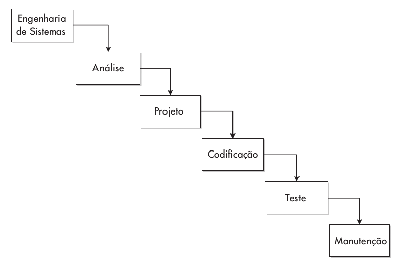

# Engenharia de Software e Sistemas Multiagentes

Tópicos a serem aboradados durante a disciplina:

- Conceitos de engenharia de software
- Programação orientada o objetos
    - Python
    - xml
    - uml
- Modelos de representação de dados e redes
    - IEC 61850
    - CIM
    - Representação Nó-Profundidade
    - Simulador de Rede
    - MyGrid

## Engenharia de Software e Sistemas Multiagentes

- Sistemas Multiagentes
    - Definições
    - Arquitetura
    - Plataformas PADE e JADE

- Projeto Final

## O que é engenharia de software?

Desciclopédia:

> Engenharia de software é algo que não se pode definir, pois nada, absolutamente nada, nesta área é deterministico. Tudo vem do bom senso, ou melhor, do feeling. Esta área lida com pessoas, processos,atividades, gambiarras, prolixidade e tudo o mais, menos com o Software.

## O que é engenharia de software?

ES é uma aplicação de abordagens sistemáticas, disciplinadas e quantificáveis ao desenvolvimento, operação  e manutenção de software, além dos estudos dessas abordagens. (IEEE Computer Society, 2004).

ES é o processo de estudar, criar e otimizar os processos de trabalho para os desenvolvedores de software. (Wazlawick, 2013)

## O que é engenharia de software?

Engenharia de Software é o uso de uma coleção de técnicas, métodos e ferramentas que, seguindo uma abordagem metodológica, dão suporte à produção de sistemas de alta qualidade, com um orçamento determinado e dentro do cronograma estabelecido, considerando que mudanças nos requisitos e no ambiente ocorrem frequentemente. (Bruegge)

## Desafios da Engenharia de Software

Como desenvolver softwares cada vez maiores e integrados com outros softwares e, ainda, ter qualidade e produtividade adequada para atender às necessidades dos clientes e cumprir os prazos e custos?

## Outros desafios

- Heterogeneidade de ambientes
    - Desenvolvimento de técnicas de construção de software para lidar com plataformas e ambientes de execução heterogêneos e em redes
- Prazos cada vez menores
    - Desenvolvimento de técnicas que levam a uma entrega muito rápida do software, mas sem deixar de levar em conta a qualidade
- Aproveitamento de sistemas legados
    - Sistemas “antigos”, mas ainda valiosos para os usuários e organizações, devem ser mantidos operacionais e atualizados de maneira eficiente

## Crise do Software (1972)

- Avalia-se que considerando o rápido progresso do hardware e as demandas por sistemas cada vez mais complexos, os desenvolvedores simplesmente estavam se perdendo, por que a *Engenharia de Software* na época era uma disciplina incipiente;
- Problemas apontados em 1972:
    - Projetos estorando cronograma e orçamento;
    - Produto final de baixa qualidade ou não atende os requisitos;
    - Produtos não gerenciáveis e difíceis de manter e evoluir.

## Questões importantes

- O que é software?
- O que é engenharia de software?
- O que é um processo de software?
- Quais são os custos de se adotar a Engenharia de Software?
- Quais são os métodos usados em Engenharia de Software?
- Quais são os atributos de um bom software?
- Quais são os principais desafios enfrentados pela Engenharia de Software?

## O que é então software?

> É um conjunto de itens que inclui diversos artefatos.

- Programas de computador;
- documentos;
- dados;
- entre outros.

Essa perspectiva mais ampla do conceito de software revela algumas
das necessidades inerentes à Engenharia de Software.

## Desenvolver um software não é simplesmente programar!

É preciso:

- Aquisição de conhecimento sobre o domínio do problema;
- Resolução de problema, ou seja, a criação de uma solução (um pouco ou muito de arte!);
- Construção de um sistema baseado nesta solução;
- Atividades de abstração e modelagem;
- Testes em multiplas perspectivas, verificação e validação, avaliação da qualidade;
- Atividades de gerenciamento:
    - Da concepção e análise;
    - Do projeto;
    - Da evolução.
- Documentação em diversas perspectivas.

## Técnicas, Metodologias e Ferramentas

- Processos
    - Coleção e organização de atividades e técnicas que são aplicadas ao longo do desenvolvimento do software, definindo uma abordagem metodológica;
- Métodos e Técnicas
    - Procedimentos formais para produção de resultados, eventualmente usando algum tipo de notação predefinida;
- Ferramentas
    - Instrumentos ou sistemas automatizados para executar as técnicas;
    - Exemplo: Ferramentas CASE - Computer Aided Software Engineering.

## Abstração em modelos

 - O que é um modelo?
     - Em ES, um modelo representa uma abstração de um ou mais conceitos que podem ser reproduzidos no projeto e na implementação
- Para que serve um modelo em ES?
    - Visualizar;
    - Especificar;
    - Construir;
    - Documentar;
    - e em alguns casos simular.

## Processo para o desenvolvimento de software

- Compreende a abordagem metodológica para o desenvolvimento, manutenção e evolução do software.
- Atividades genéricas em todos os processos de software incluem:
    - Cocepção e elicitação de requisitos;
    - Análise e especificação;
    - Projeto;
    - Codificação;
    - Teste e validação;
    - Manutenção;
    - Documentação e uso de técnicas que deem melhor suporte à evolução do software.

## Classificação dos tipos de processo

Podem ser baseados em aspectos prescritivos ou evolucionários

- Processos Prescritivos:
    - Consideram a sequencialidade entre as etapas da concepção à implantação, cada uma dependendo da etapa imediatamente anterior.
    - Incluem as metodologias mais tradicionais, como o Cascata.
- Processos Evolucionários:
    - Consideram a entrega de software de maneira incremental ao longo de todo o processo
    - Incluem as metodologias ágeis

## Processo Cascata

{ width=3.5in }

## Processo Cascata

- Uma atividade não é iniciada sem que a anterior tenha sido encerrada e aprovada
- Há uma sequecia rígida de atividades
- O usuário/cliente é envolvido somente no início e no final do processo.

## Modelo V

{ width=3.5in }

## Modelo V

Inspirado no Cascata e usado como padrão em projetos alemães [Hirama]
Preocupa-se com o planejamento de testes nas fases de desenvolvimento
Testes de mais alto nível são realizados se o atual for bem sucedido

## Processo Evolutivo

{ width=3.5in }

## Processo Evolutivo

- Procuram atender aos requisitos que se modificam durante o desenvolvimento
- Viabiliza o lançamento de versões intermediárias para atender às pressões e à competitividade de mercado
- Processos evolutivos iniciam com um subconjunto de requisitos de sistema, que é
desenvolvido e incrementado gradualmente
- Processos evolutivos são iterativos: o software é desenvolvido evolutivamente em direção ao produto final, cada vez mais completo.

## Processo Unificado

{ width=3.5in }

## Processo Unificado

- O Processo Unificado foi uma proposta desenvolvida para unificar uma
série de abordagens existentes e servir como guia para os desenvolvedores
de software.
- É estruturado em duas dimensões: fases e fluxos de trabalho (workflows).
- É dirigido pelos Casos de Uso.
- O produto é desenvolvido de forma iterativa (iterações) e incremental.

## Extreme Programming

{ width=3.5in }

## Extreme Programming

- Planejamento incremental;
- Pequenos entregáveis;
- Projeto simples;
- Desenvolvimento de testes antes do código;
- Refatoração (refactoring) frequente do código;
- Programação em pares;
- Propriedade coletiva do código;
- Integração contínua do sistema;
- Ritmo sustentável de trabalho;
- Cliente no local (on-site) em tempo integral.

## Tarefas para a próxima aula (28/04)

- Ler material a respeito de UML.
- Se familiarizar com as ferramentas da linguagem Python:
    - Anaconda;
    - Sublime Text;
    - PyCharm;
    - Jupyter Terminal e Notebook;
- Modelar sistema proposto em UML e implementá-lo em Python.
