# IEC 61970-301 E IEC 61968-11 Commom Information Model (CIM) para Sistemas Elétricos de Potência (SEP)

## Introdução

É de fundamental importancia a existencia de padrões que possibilitem a troca de informações entre aplicações do setor elétrico, principalmente quando se pensa em um sistema interconectado, mas operado por diferentes companhias.

Sendo assim, sempre existe a necessidade de troca de informações entre aplicações dentro do ambiente interno de uma empresa do setor elétrico, assim como entre empresas diferentes, visto a grande quantidade de aplicações utilizadas dentro de uma empresa do setor elétrico, como por exemplo:

- Software de monitoramento e comando remoto (SCADA);
- Software de fluxo de carga e curto-circuito;
- Software de análise de transitórios eletromecânicos;
- Software para parametrização de dispositivos de proteção;
- Software de gestão de ativos;
- Software para cálculo de faturas de energia;
- Entre muitos outros.

Existe portanto um grande número de formatos proprietários e diferentes que exigem a utilização de conversores. Esse número de conversões aumenta exponencialmente quando o sistema se torna  complexo.

O padrão, IEC 61970-301 é um modelo semântico que descreve os componentes de um sistema elétrico de potência no nível elétrico e as relações entre cada um desses componentes.

O padrão IEC 61968-11 extende o padrão anterior de modo a cobrir  aspectos mais gerencias como por exemplo: Gerenciamento de ativos, planejamento de trabalho e faturamento de clientes.

Esses dois padrões, 61970-301 and 61968-11 são amplamente conhecidos como Common Information Model (CIM) para sistemas elétricos e têm dois objetivos principais: 

- facilitar a troca de dados da rede elétrica entre diferentes empresas;
- facilitar a troca de dados entre aplicações em uma mesma companhia.

O CIM é portanto um padrão **aberto** para representação dos componentes do SEP e que foi desenvolvido pela EPRI nos Estados Unidos, inicialmente utilizado como um modelo de dados para uma aplicação de Gerenciamento de Energia.

## Formato de dados em arquivos para softwares do SEP

Em um ambiente com diversos softwares de diferentes versões que precisam se comunicar é necessário elaborar um esquema que proporcione essa comunicação. Entre diversas opções existentes, a mais indicada seria:

- Utilização de um formato de dados detalhado compatível com todas as aplicações que possua estruturas capazes de realizar a representação **básica** do sistema elétrico, mas que ao mesmo tempo permita uma descrição mais específica ou detalhada, semno entanto quebrar a formatação do arquivo.

São exigidas para isso as três premissas:

- Um modelo detalhado de dados que permita a descrição do SEP;
- Um formato de dados extensível;
- A adoção desse formato de dados pelos principais produtores e comercializadores de softwares para o SEP.

O CIM tem o objetivo de atender ao primeiro requisito;

O formato de dados **xml** (*extensible markup language*) tem o papel de preencher o segundo pre-requisito;

Já a adoção do padrão pela comunidade de software é um desafio mais comercial do que técnico, mas que vem se mostrando possível com a adoção do CIM pelas principais produtoras de software para o SEP.


## Estrutura das classes do CIM

Para exemplificar o CIM, vamos começar modelando um disjuntor. O disjuntor pode ser pensado de diferentes níveis de abstração, dependendo da aplicação a ser utilizada. 

De maneira geral, o disjuntor é um equipamento do SEP, que conduz eletricidade e que tem como característica principal abrir e fechar um circuito, e como característica específica ser capaz de interromper correntes de curto-circuito.

Podemos representar o disjuntor por meio do seguinte conjunto de classes relacionadas:

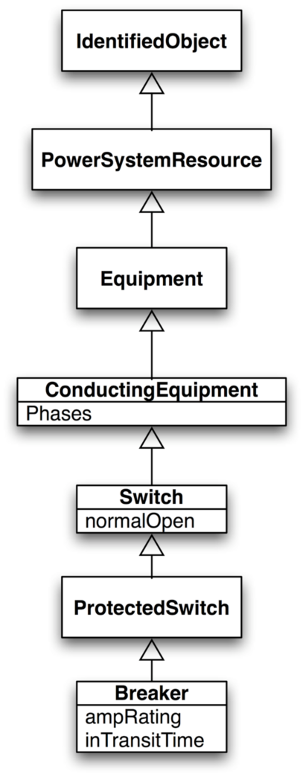

## Subclasses da classe Switch

Assim como a classe **Breaker**, o padrão CIM possui outras subclasses da classe **Switch**, por exemplo:

- Jumper;
- Fuse;
- Disconnector;
- LoadBreakSwitch;
- GroundDisconnector.

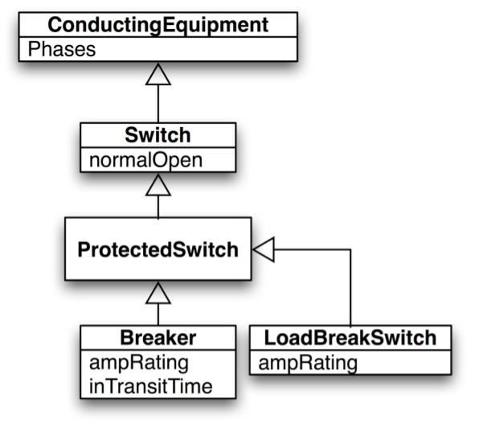

Este esquema é bastante útil, pois por meio da herança é possível tratar tanto a classe **Breaker** como a classe LoadBreakSwitch como tipos de chaves. Por exemplo, isso facilita a tarefa de um software de busca topológica que não tem necessidade de saber os atributos específicos da chave, mas apenas se esse ponto permite uma desconexão do sistema, e assim por diante.

Também é possível realizar a inserção de novos tipos de dispositivos sem interferir na estrutura geral do modelo de dados.

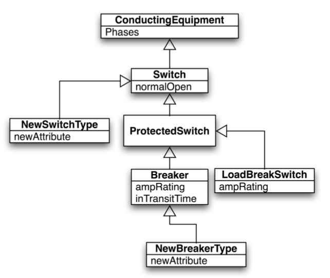

## Interconexão de Equipamentos

O CIM utiliza a abstração de **Terminais** e **Nós Conectivos** para definir a interligação entre equipamentos.

Considere o seguinte circuito:

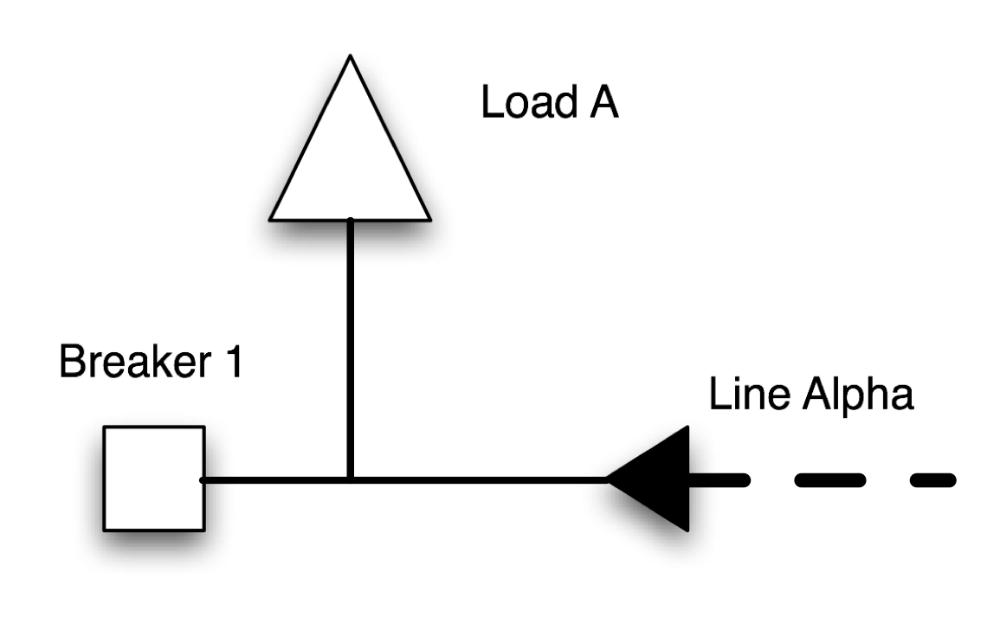

Associações diretas entre os elementos poderia resultar em uma ligação do tipo:

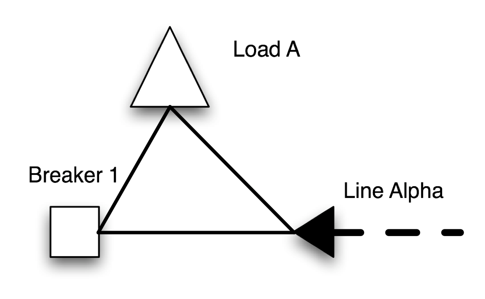

Para evitar esse tipo de confusão o CIM adota a abstração de nós conectivos:

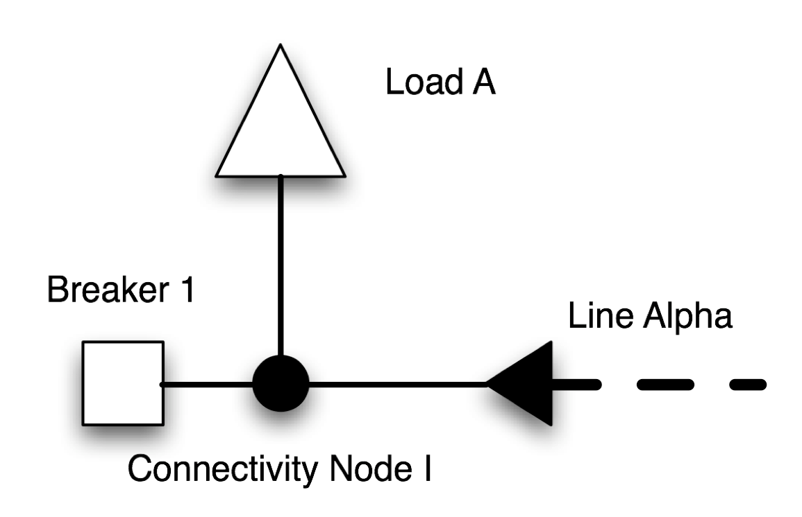

Para o CIM, no entanto, não existe ligação direta entre equipamentos e nós conectivos, e sim entre seus terminais.

Em UML essa relação é expressa da seguinte forma:

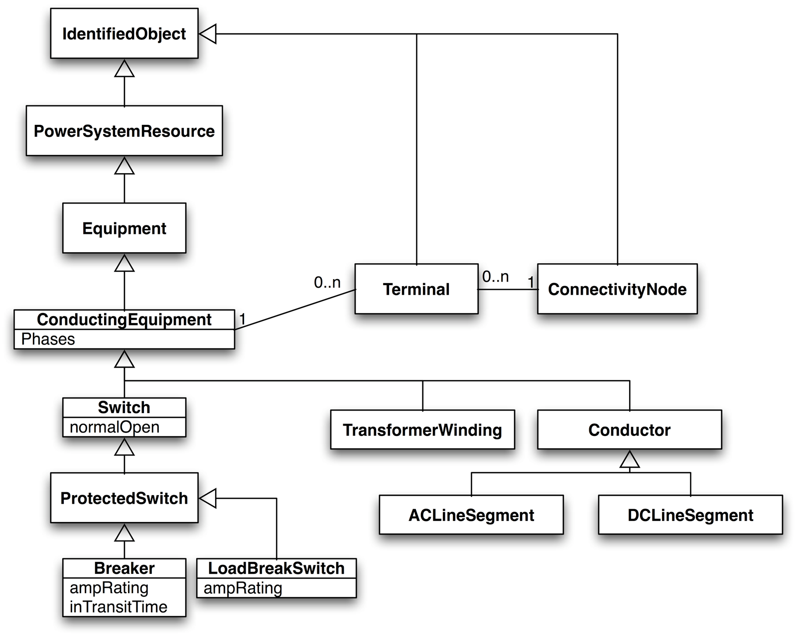

Assim, o circuito analisado ficaria:

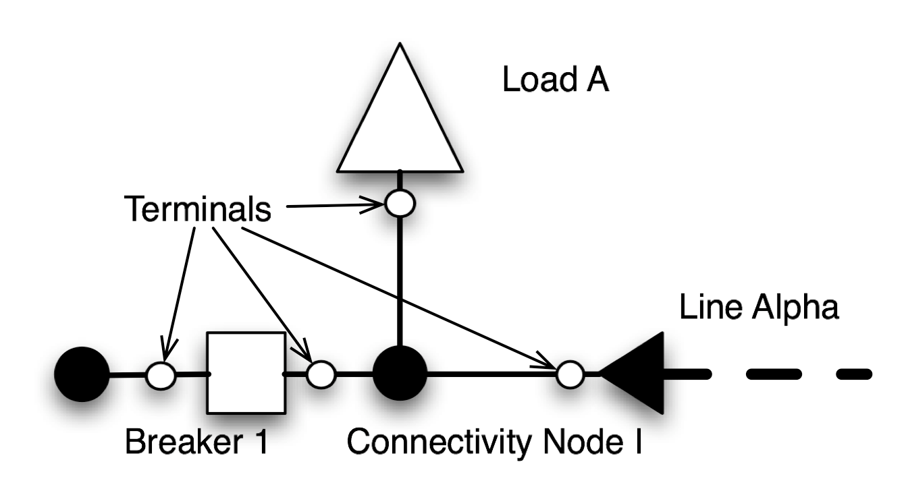

## Exemplo de representação de sistema

Segue exemplo um pouco mais complexo de como representar os componentes de um sistema elétrico por meio do padrão CIM:

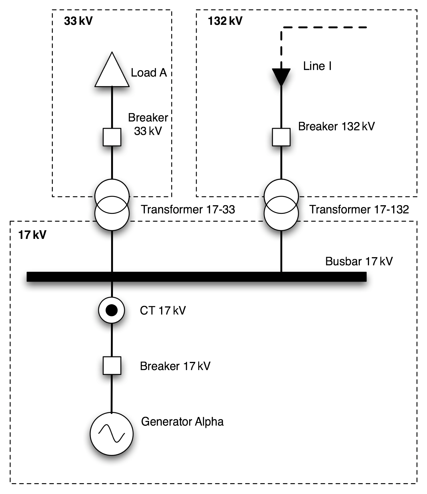

Esse circuito contém os seguintes elementos:

- 01 gerador;
- 01 carga;
- 01 entrada de linha;
- 01 barramento;
- 02 transformadores;
- 03 níveis de tensão: 33kV, 132kV e 17kV;


Os elementos identificados estão mostrados na Figura:

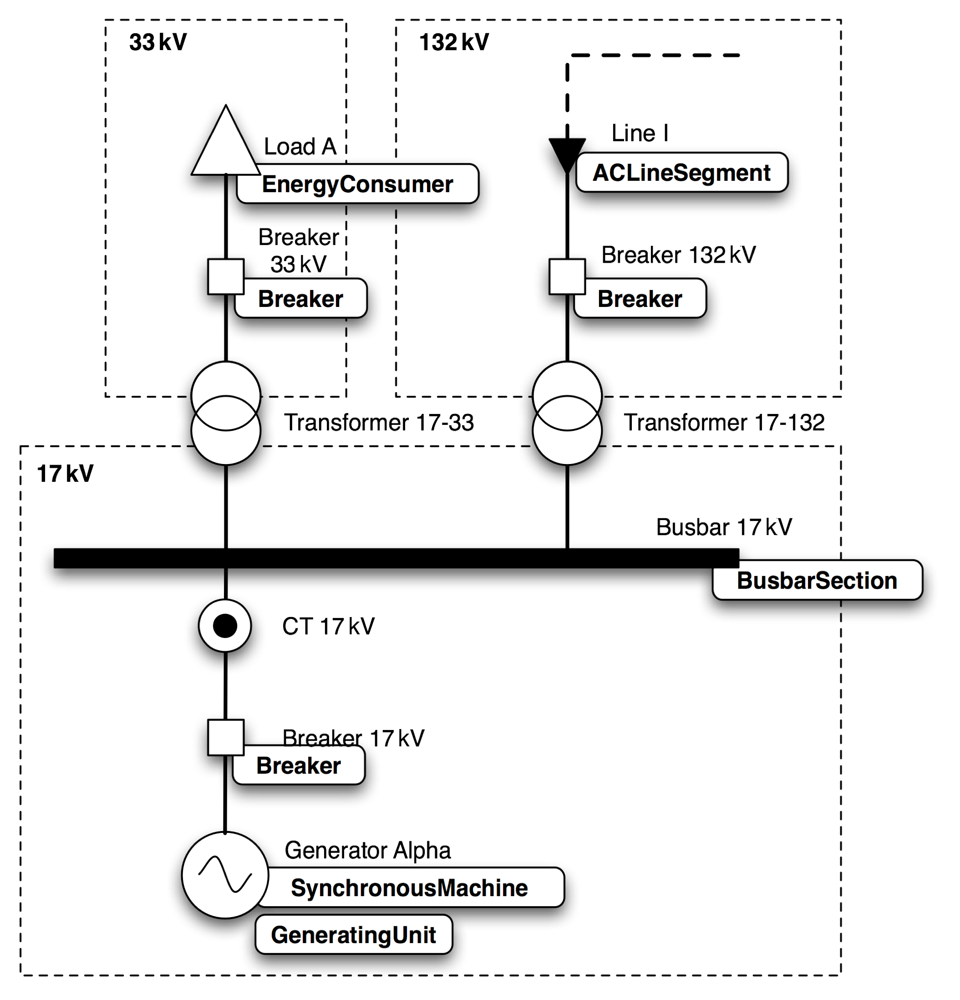 

Mas e os transformadores? Como são representados pelo CIM?

Neste caso a representação do CIM para os transformadores é de que estes são formados por um conjunto de classes, dentre elas a classe **PowerTransformer** que funciona como uma classe container da classe **TransformerWinding**.

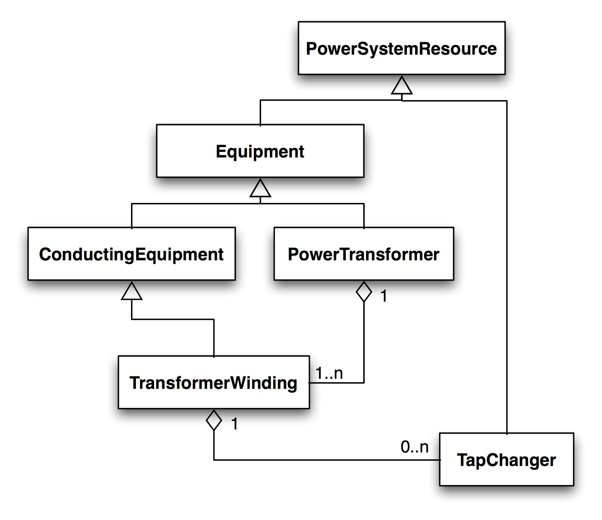

É interessante observar que, embora o elemento **PowerTransformer** seja um equipamento do sistema, ele não conduz corrente por sí só, por isso não herda da classe **ConductingEquipment**, essa herança só ocorre na classe **TransformerWinding**. O elemento **TapChanger** é parte do **TransformerWinding** e embora tenha suas características especificas não é considerado um equipamento mas parte integrante do **TransformerWinding**, por isso não herda da classe **Equipment**.

Dessa forma o transformador do sistema exemplo apresentado, no CIM, é representado por quatro classes:

- 01 PowerTransformer;
- 02 TransformerWinding;
- 01 TapChanger.

## Containers no CIM

Outra importante categoria de representação de equipamentos no CIM são as classes que agrupam os elementos por meio de categorias, alguns exemplos de agrupamento são:

- Agrupamento por nível de tensão;
- Agrupamento por 'coleção de equipamentos', exemplo: classe **SubStation**, ou **Line**.

Dessa forma, o sistema exemplo pode ser representado graficamente no CIM de acordo com a Figura:

 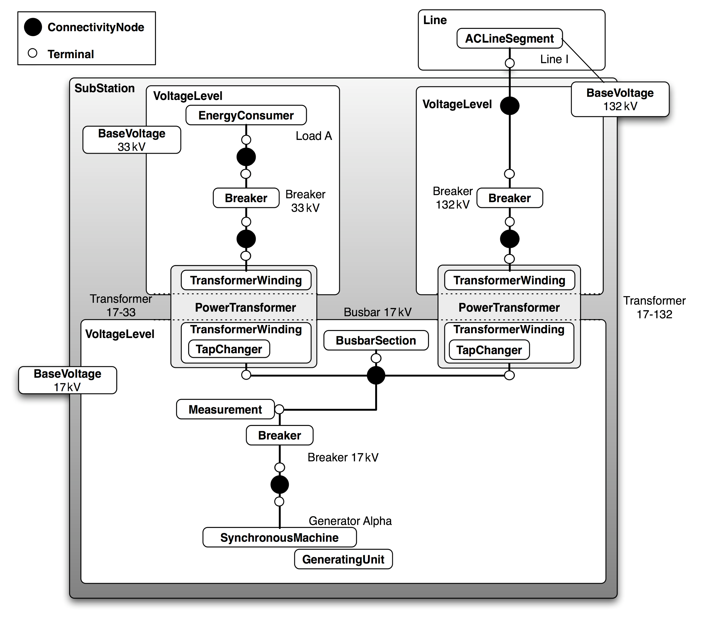

## Pacotes presentes no CIM IEC 61970-301 CIM Packages

As classes utilizadas para descrever e modelar cada um dos componentes do SEP estão organizadas no CIM em pacotes que agrupam as classes de acordo com seus relacionamentos. São eles:

- Wires: Define os componentes que estão fisicamente conectados no sistema, como pontos de geração e consumo, transformadores, seguimentos de linha, chaves, barramentos, compensadores, entre outros;
- Generation: Define diversos tipos de geradores, com classes que representam plantas de geração hídrica ou térmica;
- LoadModel: Modela os tipos de carga e consumidores;
- Topology: Define todas as estruturas e abstrações utilizadas pelo CIM para representar as interconexões topologicas do SEP, tais como nós conectivos, terminais e as ilhas topológicas;
- Measurement: Define as estruturas necessárias a realização de medidas no SEP que podem ser de natureza não elétricas quando associadas a um equipamento, ou de natureza elétrica quando associadas a um terminal;
- Outages: Modela o classes que se relacionam com chaves para definir seu estado em um determinado instante de tempo; 
- Protection: Define as configurações e parâmetros das funções de proteção associadas aos relés que comandam os dispositivos de interrupção do sistema, como por exemplo: corrente de pickup, tempo definido de atuação, limites de atuação, entre outros.


## Extensible Markup Language (XML)

O xml é um formato universal para dados e documentos estruturados que vem se tornando rapidamente um padrão para *machine-redable data*. O xml é considerado uma meta-linguagem que permite aos usuários desenvolver suas próprias tags para descrição dos dados.

Exemplo de xml:

```xml
<?xml version="1.0" encoding="UTF-8"?>

<!--> Estrutura da rede em analise</!-->
<rede>
    <elementos>
        <chave nome="1" estado="fechado"/>
        <chave nome="2" estado="fechado"/>
        <chave nome="3" estado="fechado"/>
        <chave nome="4" estado="aberto"/>
        <chave nome="5" estado="aberto"/>
        <no nome="S1">
            <pot tipo="ativa" multip="k" unid="W">0.0</pot>
            <pot tipo="reativa" multip="k" unid="VAr">0.0</pot>
        </no>
        <no nome="A1">
            <pot tipo="ativa" multip="k" unid="W">200.0</pot>
            <pot tipo="reativa" multip="k" unid="VAr">150.0</pot>
        </no>
    </elementos>
</rede>
```


Um exemplo de código em python para ler as informações de um arquivo xml pode ser:

```python
from bs4 import BeautifulSoup

f = open('rede.xml')

soup = BeautifulSoup(f, 'xml')

for i in soup.find_all('chave'):
    print i['nome'], i['estado']

l = list()
for i in soup.find_all('no'):
    pots = i.children
    for pot in pots:
        try:
            l.append(float(pot.string))
        except:
            pass
```

### XML Schema

Apenas utilizando as notações presentes na linguagem xml não é possível definir sintaxe e semântica para um arquivo xml.

Esse tipo de informação pode ser descrito em um arquivo do tipo **xml-schema**. O **xml-schema** define:

- Os elementos e atributos que um arquivo xml pode conter;
- Quais desses elementos são tags filhas;
- Quantas tags filhas cada elemento pode conter;
- Quando um elemento pode conter texto;
- O tipo de dados de um elemento e seus atributos;
- Quais valores de elementos são fixos e se existe um valor padrão para esses elementos.

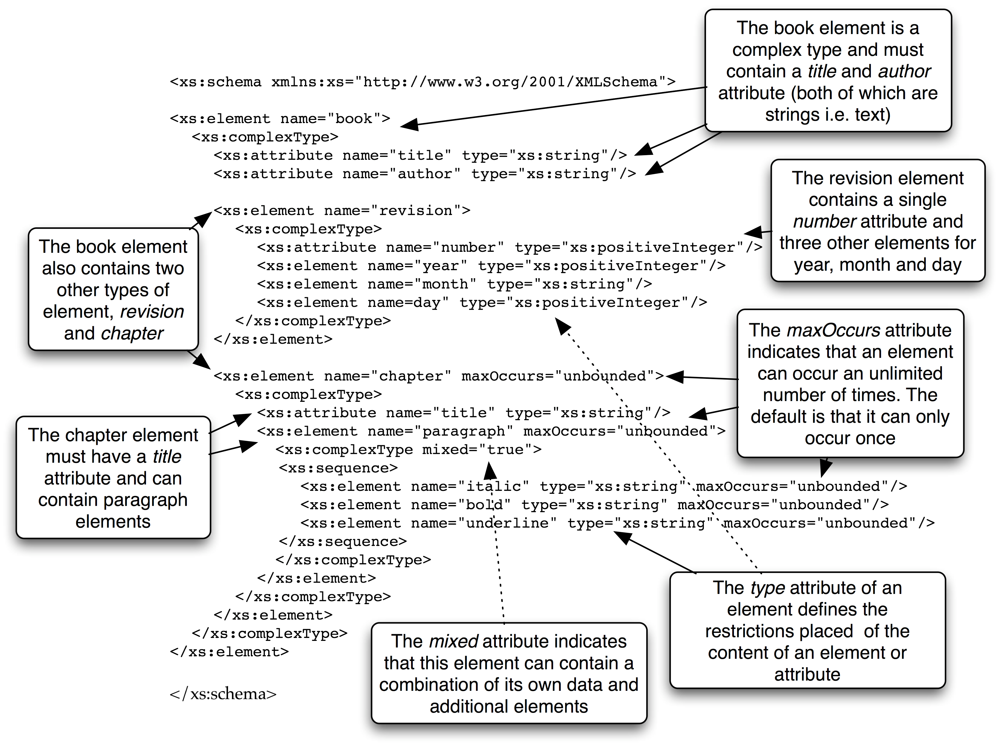

### RDF 

Arquivos xml permitem a elaboração apenas de relações do tipo pai-filho, para expressar uma relação de associação entre tags que não pai-filho é preciso recorrer ao **RDF**, que atribui indices de identificação (id) únicos para cada elemento. Veja o exemplo:

```xml
<library name=”Glasgow Library”>
    <book title=”History of Glasgow, 1900-1950” author=”Walter Hannah”>
        <position section=”A” shelf=”2”/>
    </book>
    <book title=”A Brief History of Time” author=”Stephen Hawking”>
        <position section=”E” shelf=”4”/>
    </book>
    <book title=”History of Glasgow, 1950-2000” author=”Walter Hannah”>
        <position section=”A” shelf=”2”/>
    </book>
</library>
```

Se quisermos relacionar os livros e *History of Glasgow, 1900-1950* e *History of Glasgow, 1950-2000* indicando uma ordem de leitura isso não seria possível utilizando apenas xml.

Em **RDF** isso seria feito da seguinte forma:

```xml
<rdf:RDF xmlns:rdf="http://www.w3.org/1999/02/22-rdf-syntax-ns#"
xmlns:lib="http://www.strath.ac.uk/libraries/2006/library-schema#">
    <lib:library lib:name=”Glasgow Library”>
        <lib:book lib:title=”History of Glasgow, 1900-1950” lib:author=”Walter
        Hannah” rdf:ID=”_entry0001”>
            <lib:position lib:section=”A” lib:shelf=”2”/>
            <lib:sequel rdf:resource=”#_entry0003”/>
        </lib:book>
        <lib:book lib:title=”A Brief History of Time” lib:author=”Stephen Hawking”
        rdf:ID=”_entry0002”>
            <lib:position lib:section=”E” lib:shelf=”4”/>
        </book>
        <lib:book lib:title=”History of Glasgow, 1950-2000”
        Hannah” rdf:ID=”_entry0003”>
            <lib:position lib:section=”A” lib:shelf=”2”/>
            <lib:sequelTo rdf:resource=”#_entry0001”/>
        </lib:book>
    </lib:library>
</rdf:RDF>
```


### RDF Schema

No CIM é feita a utilização dessas duas tecnologias para que tanto as relações entre os elementos do sistema possam ser representadas em xml quanto a sintaxe desses elementos possam ser fixadas. Com base no exemplo anterior, um RDF Schema poderia ser elaborado da seguinte maneira:

```xml
<rdfs:Class rdf:ID="book>
    <rdfs:label xml:lang="en">Book</rdfs:label>
    <rdfs:comment>A book contained within a library</rdfs:comment>
</rdfs:Class>
<rdf:Property rdf:ID="sequel">
    <rdfs:label xml:lang="en">Sequel</rdfs:label>
    <rdfs:comment>Indicates that the book has a sequel that is also within the
    library</rdfs:comment>
    <rdfs:domain rdf:resource="#book"/>
    <rdfs:range rdf:resource="#book"/>
</rdf:Property>
<rdf:Property rdf:ID="sequelTo">
    <rdfs:label xml:lang="en">SequelTo</rdfs:label>
    <rdfs:comment>Indicates that the book is the sequel to another book also
    within the library</rdfs:comment>
    <rdfs:domain rdf:resource="#book"/>
    <rdfs:range rdf:resource="#book"/>
</rdf:Property>
```

Neste RDF Schema são definidas a classe *Book* e as propriedades *sequel* e *sequelTo*. Cada uma das propriedades apresenta:

- domain: que é a classe cuja propriedade pertence;
- range: que é a classe que a propriedade se refere.

A descrição de uma subclasse também pode ser declarada via RDF Schema, por exemplo:

```xml
<rdfs:Class rdf:ID="novel>
    <rdfs:label xml:lang="en">Novel</rdfs:label>
    <rdfs:comment>A fictional book</rdfs:comment>
    <rdfs:subClassOf rdf:resource="#book"/>
</rdfs:Class>
```

## CIM RDF XML


Tanto o RDF quanto o RDF Schema provêm formas de realizar um mapeamento entre o design orientado a objetos para xml, dessa forma o padão CIM pode ser mapeado para xml.

A estrutura de classes CIM mostradas na figura podem ser modeladas em xml:


```xml
<rdfs:Class rdf:ID="PowerSystemResource">
<rdfs:label xml:lang="en">PowerSystemResource</rdfs:label>
<rdfs:subClassOf rdf:resource="#Naming"/>
</rdfs:Class>

<rdfs:Class rdf:ID="Equipment">
<rdfs:label xml:lang="en">Equipment</rdfs:label>
<rdfs:subClassOf rdf:resource="#PowerSystemResource"/>
</rdfs:Class>

<rdfs:Class rdf:ID="ConductingEquipment">
<rdfs:label xml:lang="en">ConductingEquipment</rdfs:label>
<rdfs:subClassOf rdf:resource="#Equipment"/>
</rdfs:Class>

<rdfs:Class rdf:ID="PowerTransformer">
<rdfs:label xml:lang="en">PowerTransformer</rdfs:label>
<rdfs:subClassOf rdf:resource="#Equipment"/>
</rdfs:Class>

<rdfs:Class rdf:ID="TransformerWinding">
<rdfs:label xml:lang="en">TransformerWinding</rdfs:label>
<rdfs:subClassOf rdf:resource="#ConductingEquipment"/>
</rdfs:Class>

<rdfs:Class rdf:ID="TapChanger">
<rdfs:label xml:lang="en">TapChanger</rdfs:label>
<rdfs:subClassOf rdf:resource="#PowerSystemResource"/></rdfs:Class>
</rdfs:Class>

<rdf:Property rdf:ID="TransformerWinding.MemberOf_PowerTransformer">
<rdfs:label xml:lang="en">MemberOf_PowerTransformer</rdfs:label>
<rdfs:domain rdf:resource="#TransformerWinding"/>
<rdfs:range rdf:resource="#PowerTransformer"/>
</rdf:Property>

<rdf:Property rdf:ID="TapChanger.TransformerWinding">
<rdfs:label xml:lang="en">TransformerWinding</rdfs:label>
<rdfs:domain rdf:resource="#TapChanger"/>
<rdfs:range rdf:resource="#TransformerWinding"/>
</rdf:Property>
```

Cada classe CIM tem seu correspondente *rdfs:Class*, enquanto as duas agregações existentes são expressas por meio das *rdf:property* com os *ranges* e *domains* apropriados.

Dessa forma o RDF Schema pode ser utilizado para modelar as estruturas de classes do CIM e assim gerar um RDF XML que represente o sistema.

## CIM RDF XML Example

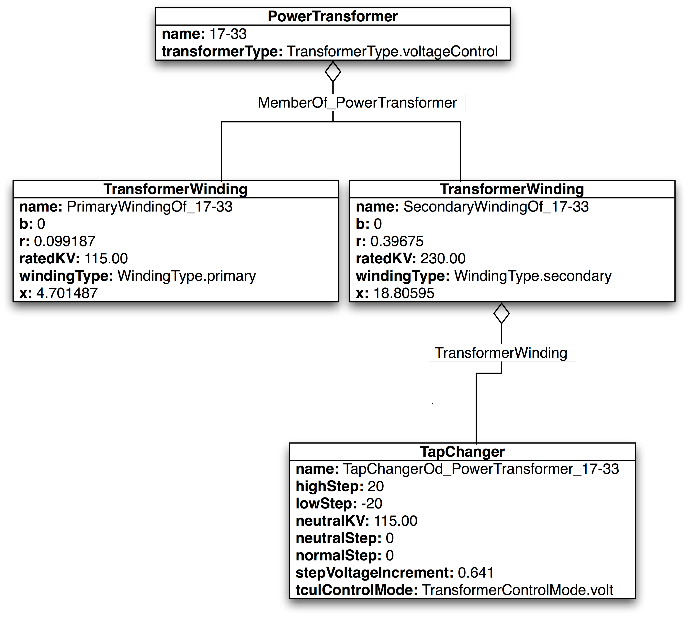

A representação do sistema acima pode ser feita em rdf xml:

```xml
<rdf:RDF xmlns:cim="http://iec.ch/TC57/2003/CIM-schema-cim10#"
xmlns:rdf="http://www.w3.org/1999/02/22-rdf-syntax-ns#">

<cim:PowerTransformer rdf:ID="PowerTransformer_1733">
    <cim:PowerTransformer.transformerType
    rdf:resource="http://iec.ch/TC57/2003/CIM-schema-
    cim10#TransformerType.voltageControl"/>
    <cim:Naming.name>17-33</cim:Naming.name>
</cim:PowerTransformer>

<cim:TransformerWinding rdf:ID="PrimaryWindingOf_PowerTransformer_1733">
    <cim:TransformerWinding.b>0</cim:TransformerWinding.b>
    <cim:TransformerWinding.r>0.099187</cim:TransformerWinding.r>
    <cim:TransformerWinding.ratedKV>115.00</cim:TransformerWinding.ratedKV>
    <cim:TransformerWinding.windingType
    rdf:resource="http://iec.ch/TC57/2003/CIM-schema-cim10#WindingType.primary"/>
    <cim:TransformerWinding.x>4.701487</cim:TransformerWinding.x>
    <cim:TransformerWinding.MemberOf_PowerTransformer
    rdf:resource="#PowerTransformer_302"/>
    <cim:Naming.name>PrimaryWindingOf_17-33</cim:Naming.name>
</cim:TransformerWinding>

<cim:TransformerWinding rdf:ID="SecondaryWindingOf_PowerTransformer_1733">
    <cim:TransformerWinding.b>0</cim:TransformerWinding.b>
    <cim:TransformerWinding.r>0.39675</cim:TransformerWinding.r>
    <cim:TransformerWinding.ratedKV>230.00</cim:TransformerWinding.ratedKV>
    <cim:TransformerWinding.windingType
    rdf:resource="http://iec.ch/TC57/2003/CIM-schema-
    cim10#WindingType.secondary"/>
    <cim:TransformerWinding.x>18.80595</cim:TransformerWinding.x>
    <cim:TransformerWinding.MemberOf_PowerTransformer
    rdf:resource="#PowerTransformer_302"/>
    <cim:Naming.name>SecondaryWindingOf_17-33</cim:Naming.name>
</cim:TransformerWinding>

<cim:TapChanger rdf:ID="TapChangerOf_PowerTransformer_1733">
    <cim:TapChanger.highStep>20</cim:TapChanger.highStep>
    <cim:TapChanger.lowStep>-20</cim:TapChanger.lowStep>
    <cim:TapChanger.neutralKV>115.00</cim:TapChanger.neutralKV>
    <cim:TapChanger.neutralStep>0</cim:TapChanger.neutralStep>
    <cim:TapChanger.normalStep>0</cim:TapChanger.normalStep>
    <cim:TapChanger.stepVoltageIncrement>0.641</cim:TapChanger.stepVoltageIncre
    ment>
    <cim:TapChanger.tculControlMode rdf:resource="http://iec.ch/TC57/2003/CIM-
    schema-cim10#TransformerControlMode.volt"/>
    <cim:TapChanger.TransformerWinding
    rdf:resource="#PrimaryWindingOf_PowerTransformer_302"/>
    <cim:Naming.name>TapChangerOf_PowerTransformer_17-33</cim:Naming.name>
</cim:TapChanger>
</rdf:RDF>
``` 

A junção as tecnologias CIM, XML, RDF e RDF Schema permite uma representação completa e padronizada do SEP em arquivos de puro texto que são multi-plataforma e entedíveis tanto por máquinas quanto por humanos. 